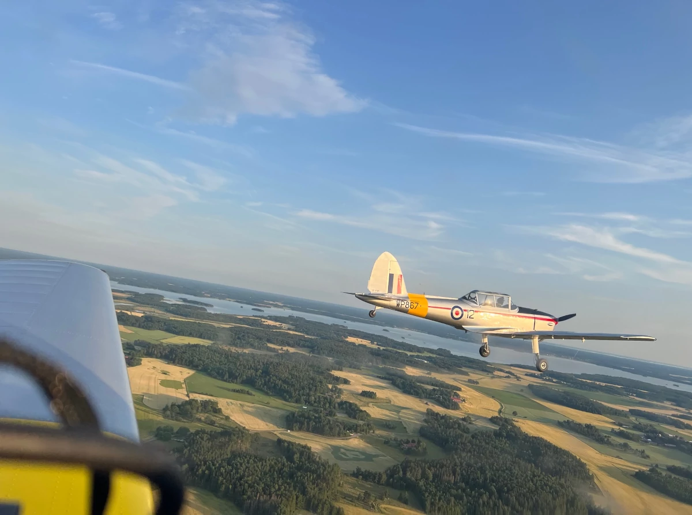

With us, you can fly as good old days. We are passionate about old aircraft and want to spread knowledge and classic technology. Whether you have no flying experience at all and just want to join us for a ride in one of our vintage aircraft to experience flying from a bygone era, or if you are an experienced pilot and want to develop your flying skills by trying out or flying in a real classic, you won't forget the experience of flying vintage aircraft.

We are based at Västerås Hässlö (ESOW) and house the Västerås Aviation Museum, which in itself is a rarity as once the largest cantilever structure in the Nordics when the hangar was built in the 1930s.

However, since it is in the nature of aviation to move quickly and easily between different locations, we can appear at all airfields within a reasonable distance from Mälardalen; so we can spread knowledge about vintage aviation even outside our home base - get in touch, and we'll tell you more.

In addition to regular flights, we can also offer rote flights with both Chipmunks or SK16 & Yak52. We also organize technical courses for the individuals we have in our business, see News/Events for current dates.

Contact us at veteran@hasslo.org
