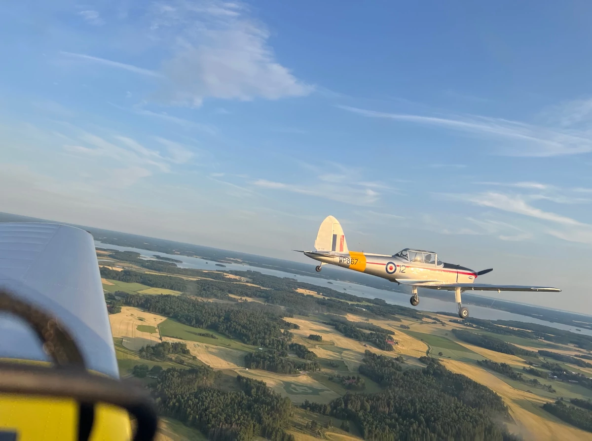

Hos oss kan du flyga som förr. Vi brinner för gamla flygmaskiner och vill sprida kunskap och gammal teknik. Oavsett om du inte har någon flygerfarenhet alls och vill bara följa med på en tur i ett av våra veteranflygplan för att få uppleva flyg från en svunnen tid eller om du är rutinerad pilot och vill utveckla ditt flygande genom att prova på eller flyga in dig på en riktig klassiker så kommer du inte glömma upplevelsen av att få flyga veteranflygplan.

Vi är baserade på Västerås Hässlö (ESOW) och huserar i Västerås Flygmuseeum som i sig är en rarität som en gång i tiden största fribärande konstruktion i Norden när hangaren byggdes på 30-talet.

Eftersom det dock ligger i flygets natur att snabbt och enkelt förflytta sig mellan olika orter kan vi dyka upp på alla flygfält inom rimlig avstånd från Mälardalen; så kan vi sprida kunskap om veteranflyg även utanför vår hemmabas - hör av dig, så berättar vi mer.

Utöver vanliga flygningar kan vi även erbjuda roteflygning med båda Chipmunkar eller SK16 & Yak52. Vi anordnar även tekniska kurser för de individer vi har i vår verksamhet, se Aktuellt/Evenemang för aktuella datum.

Kontakta oss på veteran@hasslo.org om du vill veta mera.
