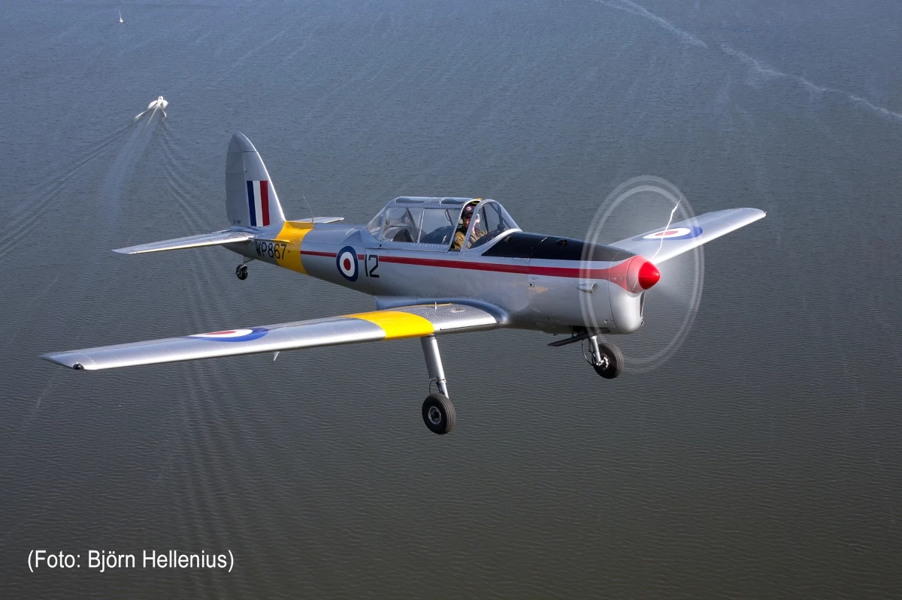
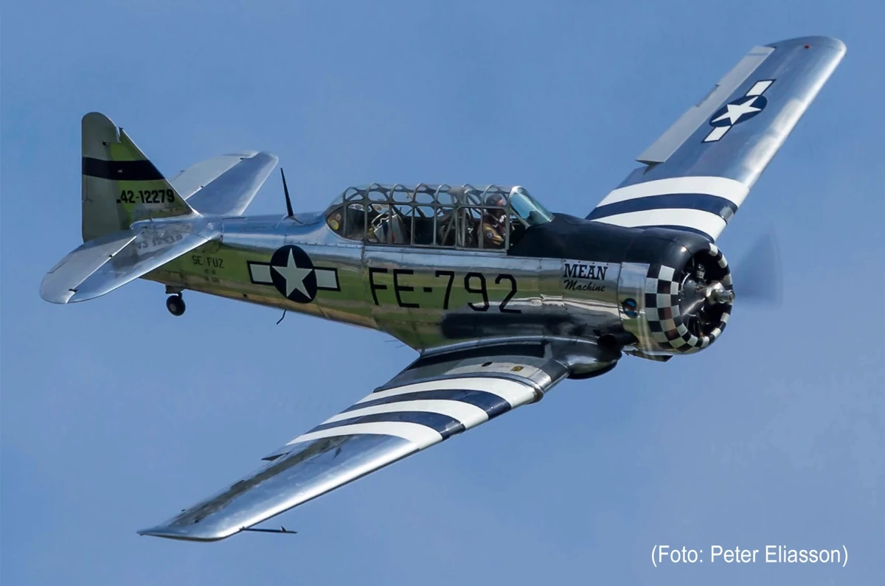
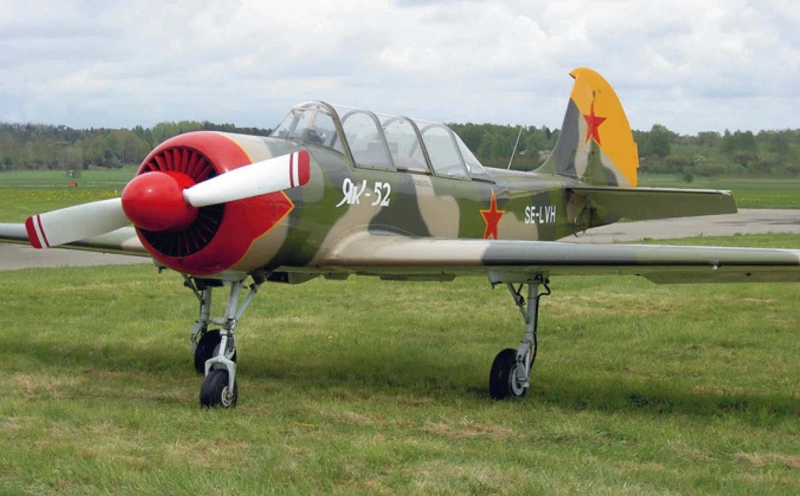
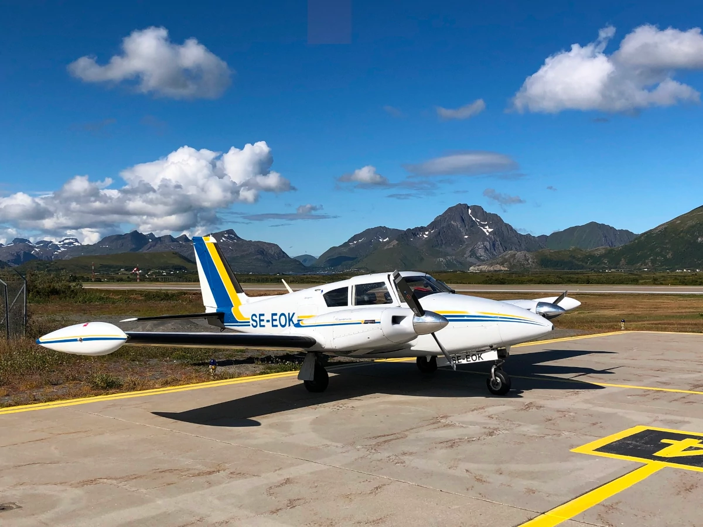

## DHC-1 DeHavilland Chipmunk

Flyg DeHavilland DHC-1 Chipmunk - “Poor Mans Spittfire” Som direkt efterföljare till Tiger Moth som grundutbildningsmaskin i flertal flygvapen (Royal British Airforce, Kanada, Danmark, Portugal, m fl) efter 2:a världskriget har Chipmunken varit första utbildningssteget för tusentals stridspiloter. Första flygning 1946 och i flygvapnens tjänst in i 70-talet. Totalt har 1284 byggds i England, Kanada och Portugal och ett stort antal är fortfarande flygande och mycket uppskattat för sina fantastiska aerodynamiska egenskaper och roderharmoni. “Chippie” är relativt enkelt (för att vara ett veteranflygplan) och är närmast perfekt som insteg i veteranflygets värld. Oavsett om du är pilot och vill göra en komplett inflygning på typen eller om du inte har flygcert och vill ändå uppleva ett klassiker i luften så så kommer du inte glömma en (prov-) lektion med våra erfarna instruktörer. Med våra två individer SE-GRK (tid danska flygvapnet byggd 1950) och SE-FNP (tid Royal Airforce byggd 1952) kan vi även erbjuda roteflygning om ni är två som vill uppleva flyghistoria tillsammans fast i var sin veteran.

Plats för en pax/elev plus vår instruktör, OBS: Maxvikt 114Kg, ingen förerfarenhet krävs.

Pris inkl instruktör:

- ca 25-30 min airborne: 2000 SEK
- ca 55-60 min airborne: 3500 SEK
- komplett inflygning: timdebitering 3100 SEK per BLOCK-timme

Kontakta oss på: anders.jacobsen@telia.com eller flyingdoktor@gmail.com

## SK16 - Noorduyn AT-16-ND Harvard IIB

“Pilot Maker” Avancerat skolflygplan som ursprungligen utvecklades i USA på 30-talet som trainer för US Airforce och som sedan kom till användning i de flesta av västvärldens flygvapen som avancerad trainer - typen kallas även för “Pilot Maker” Vår individ SE-FUZ som är byggd 1943 har en alldeles egen och unik historia då individen var svenska militärattachéns tjänsteflygplan i slutet av 40-talet. Hos oss kan du uppleva 80-årig flyghistoria i luftvärdigt skick med våra erfarna instruktörer. Tillsammans med YAK-52 kan du även flyga i en historiskt omöjlig rote.

Plats för pax/elev samt vår instruktör, OBS: Maxvikt 110kg samt Maxlängd 185-190cm, ingen förerfarenhet krävs.

Pris inkl instruktör:

- ca 25-30 min airborne 6500 SEK

Kontakta oss på: anders.jacobsen@telia.com

## YAK-52 – Yakovlev

Gamla Sovjetunionens grundskolflygplan Utvecklat som efterföljare till YAK-50 och använd som utbildningsflygplan i i princip alla flygvapen i f.d. östblocket har denna typ efter berlinmurens fall fått ett andra liv även i västvärlden då typen anses som lättflugen och mkt lämpligt för avancerat flygning med lämplig aerodynamik och tillräckligt motorkraft. Hos oss på kan du få uppleva denna flygmaskin med svårslagen prestanda med erfaren instruktör. Vill du flyga en historiskt omöjlig rote-flygning så erbjuder vi även SK16 och YAK-52 i rote.

Plats för pax/elev samt vår instruktör, OBS: Maxvikt 90kg, ingen förerfarenhet krävs.

Pris inkl instruktör:

- ca 25-30 min airborne 3500 SEK

Kontakta oss på: anders.jacobsen@telia.com eller e.holm@svetsoteknik.se

## PA-30 - Piper Twin Commanche

Learjets propellerdrivna lillasyster Pa30 är Pipers premium tvåmotorsmaskin från tidig 60-tal med enastående prestanda. Konstruerad av Ed Swearingen som även ritade Learjet och enastående aerodynamik som än idag håller måttet. Den vassa aerodynamiken och prestandan var dock något nytt för Piper vilket gjorde att maskinen har relativ omtumlande och omdiskuterat historia med t.o.m. hot om indraget typcert från FAA. Rätt hanterat är maskinen dock mycket trevligt att flyga och fortfarande regelbunden använd som resemaskin. Första flygning 1962 och byggd i Lock Haven där även Piper Cub byggdes. I samband med fabriksstängningen 1972 las tyvärr produktionen ner; totalt blev 2142 individer byggda varav ca 1000 är fortfarande flygandes världen rund och mkt uppskattade av sina ägare som pålitlig, bekväm och effektiv resemaskin.

Vår individ SE-EOK är byggd 1963 och har funnits i Sverige sedan 1964. Nuförtiden är individen utrustat med modern (PBN-godkänd) avionik och avisning; EOK används än idag för tjänsteresor och tar sig t ex Västerås-Lofoten på 3:10 i nollvind. Hos oss kan du få uppleva denna 60-talets premium tvåmotorsmaskin med erfaren instruktör. Flygerfarenhet eller Multi Engine Rating är inget krav, vi anpassar oss till dina förutsättningar.

Plats för instruktör och upp till tre pax (max totalvikt för pax 200Kg, annars behövs lite bränsleplanering i förväg), ingen förerfarenhet krävs.

Pris inkl instruktör:

- ca 25-30 min airborne 3600 SEK
- ca 55-60 min airborne 6000 SEK
- längre flygningar: 5200 SEK per HOBBS-timme

Kontakta oss på: flyingdoktor@gmail.com

## Flygrädd

... men nyfiken på Veteranflyg ändå?

Då är du extra-välkommen hos oss på Veteranflygskolan ! Flygrädsla är inget problem för oss - tala om för oss innan flygning om du är lite (eller mycket) flygrädd så tar vi hand om dig ombord på våra maskiner och tar den tid som behövs för att du ska känna dig trygg innan starten. En flygning bredvid en rutinerad instruktör med förklaringar om hur ett flygplan fungerar och varför saker och ting sker kan faktiskt vara ett mycket bra botemedel mot flygrädsla.

## Vad krävs?

### Provlektion med eller utan förerfarenhet

För en tur med våra instruktörer krävs egentligen inte mer än någorlunda väder, intresse för gammal flygteknik och lite tid, tekniskt genomgång av flygplanet och säkerhetsgenomgång ingår självklart i varje flygning.

### Inflygning

Flygplanen vi flyger är från olika tidsepoker. Gemensamt är att alla är byggda före standardiseringens intåg i flyget. Därför har alla typer (och ibland individer) sina egna tekniska lösningar som stundtals skiljer sig rätt tydligt från dagens teknik. Vilket kräver en grundläggande tekniskt genomgång på marken innan flygningen, för komplett inflygning rekommenderar vi starkt våra tekniska kurser för typen. Untöver detta är hyfsat flygtrim starkt att rekommendera. För komplett inflygning krävs så klart att cert & behörigheter (SEP, MEP, Sporre) är giltiga, för enbart prova på är detta dock inget krav.

### Det Finstilta

Att flyga i gamla flygplan har sin oförglömliga charme och skall självklart vara säkert ! Att vi alltid följer alla regler, lagar och respekterar eventuella minima / begränsningar är en självklarhet för oss. För att alla skall bli nöjda ber vi dig har följande i åtanke:

- Flygplanen uppfyller självklart alla krav på säkerhet som ställs på dagens General Aviation (Normal- eller X-klassat).
- Komforten är tidsenligt. Flygplanen är inte handikappanpassade, normal rörlighet krävs för att ta sig in och ur maskinerna.
- Våra flygplan är mindre och har en definierad max TakeOff Weight vilket begränsar totalvikten av alla passagerare. Instruktören kommer efterfråga er vikt i kg i förväg för att kunna beräkna massa och balans innan flygning.
- Vi rekommenderar starkt oömma kläder och stabila skor. Olja, smörjmedel, flygbränsle och på vissa maskiner avisningsvätska tillhör flygande flygplan. Vi tar inte ansvar för ev oljefläckar eller dylikt på kläder, etc.
- NOLL TOLERANS för alkohol och droger är en självklarhet för oss inom flyget!
- Flygningarna kan ställas in även med kort varsel av Instruktören pga väder, teknik, eller andra skäl. Beslutet om att genomföra flygningen åligger enbart instruktören.
- Instruktören är alltid befälhavaren ombord på våra veteranflygpan och har ensam beslutsrätt ombord enligt Luftfartslagen. Alla anvisningar och beslut är bindande och skall följas ovillkorligen!

