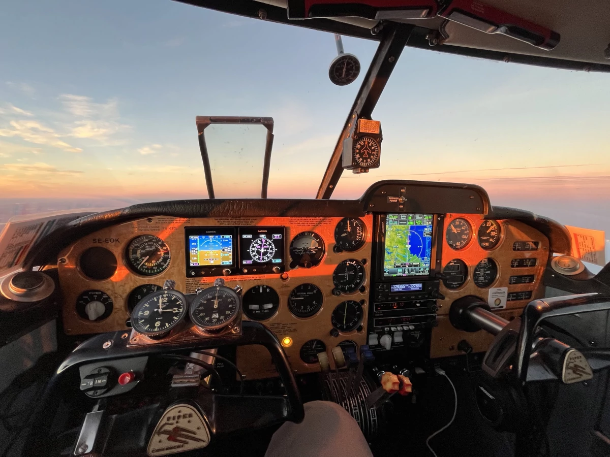

Do you need a ME-IR-PC? Why not make it a real classic?

Västerås Veteran Flight School offers ME-IR PC on a premium Light Twin from the 60s with modern avionics and full PBN approval. Our Pa30 SE-EOK is still used for business trips to Northern Norway and is available with our instructors who also have controller authorization. Technical review of the machine is included before flight, however, the machine is somewhat more complex with manual engine & propeller handling and relatively sharp aerodynamics; therefore, some experience in older and complex 2-motor machines is recommended.

- SEK 4,400 per Hobbs hour plus SEK 2,000 controller fee.

Contact us at flyingdoktor@gmail.com
